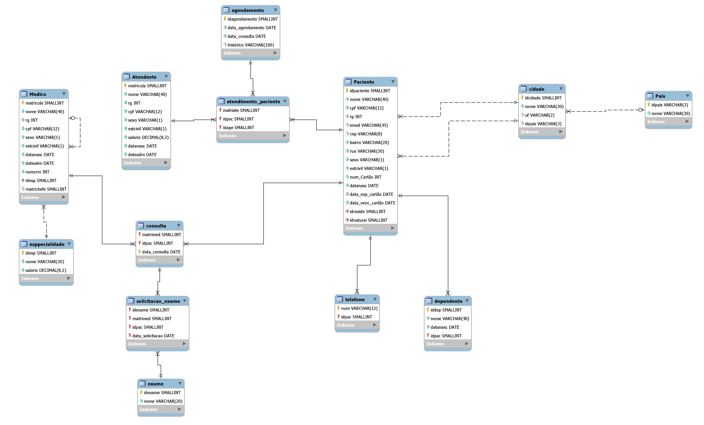

# Clínica

Projeto para a disciplina de Banco de Dados I do segundo período de TSI no IFPB.

Grupo:
* [John Oliver]
* [Tales Medeiros]
* [Marlon Fernando]

## Descrição

A Clínica precisa manter dados sobre o controle de fluxo das consultas a serem feitas.
Funcionários possuem características como nome, matrícula, sexo, estado civil, data de nascimento e data de admissão. Cada funcionário pode ser médico ou atendente, sendo estes definidos por número do crm e salário do atendente respectivamente.
Um médico pode chefiar um ou vários médicos, assim como os médicos só podem ser chefiados por apenas um médico. Cada médico possui uma única especialidade, que é composta por nome e salário e identificada pelo id da especialidade. E uma especialidade pode ser comum a vários ou nenhum médico.
Um médico pode atender a nenhum ou a vários pacientes, da mesma forma como um paciente pode ser atendido por um ou vários médicos.
Quando um médico está atendendo um determinado paciente, esta consulta pode gerar nenhum ou vários exames, sendo estes indentificados pela data de sua solicitação,o id do paciente e a matricula do médico de modo que os exames podem ser solicitados nenhuma ou várias vezes durante um atendimento. Um exame possui um nome e um código do exame. E um paciente possui nome, id, cpf, rg, email, sexo e endereço. Para que o paciente possa ser atendido, precisa-se antes, marcar um agendamento. Um atendente pode atender a nenhum ou a vários pacientes, assim como um paciente pode ser atendido por um ou vários atendentes. Quando um atendente atende um cliente, pode ser marcado nenhum ou vários agendamentos.
Um paciente pode possuir nenhum ou vários telefones, assim como um telefone pertence a um só cliente. Assim, é armazenado apenas o número do telefone. E o telefone é identificado pelo número e pelo código do paciente .
Todo paciente possui um único cartão-cliente, e cada cartão-cliente é referente a um único paciente. São característicos do cartão-cliente seu número, a data de vencimento do catão, e a data de expedição.
Um paciente pode ser natural de apenas uma cidade, assim como uma cidade pode ter nenhum ou vários pacientes que são natural de lá.
O paciente também pode residir em apenas uma cidade, de forma que em uma cidade reside nenhum ou vários pacientes. E uma cidade está contida em um só país, da mesma forma como um país pode conter uma ou várias cidades.

### Modelo Conceitual

### Modelo Lógico

[John Oliver]: <https://github.com/johnoliver23>
[Tales Medeiros]: <https://github.com/Tales313>
[Marlon Fernando]: <https://github.com/marlonfernando16>